# Results Summary and Physical Interpretation

This document interprets the uploaded simulation figures for FCC copper-like molecular dynamics using Lennard-Jones interactions and velocity-Verlet integration.

## Key observables
The analysis tracks kinetic, potential, and total energy:

$$
E_{\mathrm{tot}}(t)=E_{\mathrm{kin}}(t)+U(t),
$$

and instantaneous temperature:

$$
T(t)=\frac{2E_{\mathrm{kin}}(t)}{3Nk_B}.
$$

## Force and potential distribution (0 K, 300 K, 1600 K)
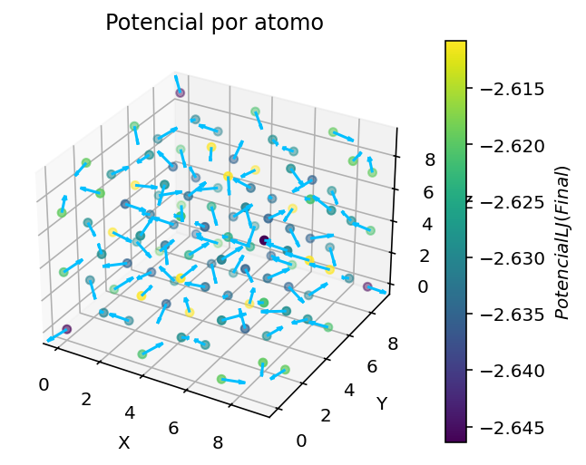
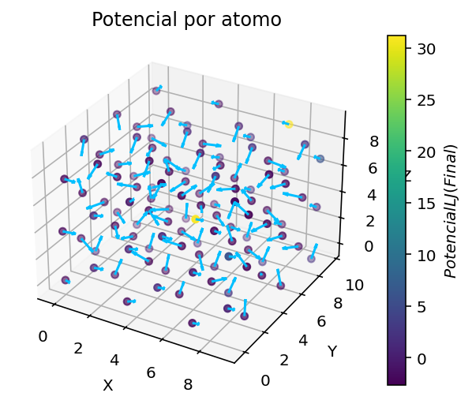
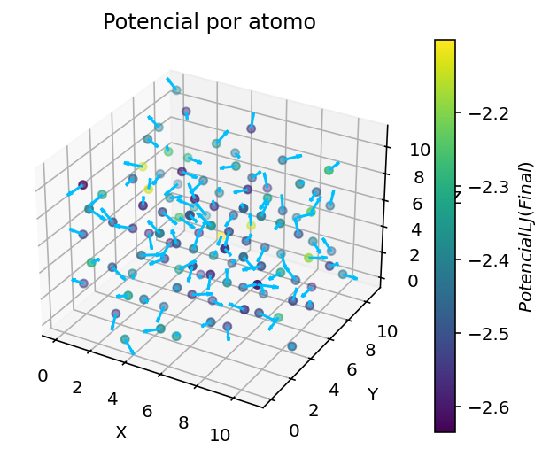

At 0 K, atoms remain close to ideal FCC positions, so local potential/force maps are comparatively uniform. At 300 K, thermal vibrations broaden local distributions while preserving crystalline organization. At 1600 K, thermal disorder is stronger and the spread in local force/potential values increases, indicating larger excursions from equilibrium separations.

## Additional force-related energy map (800 K)
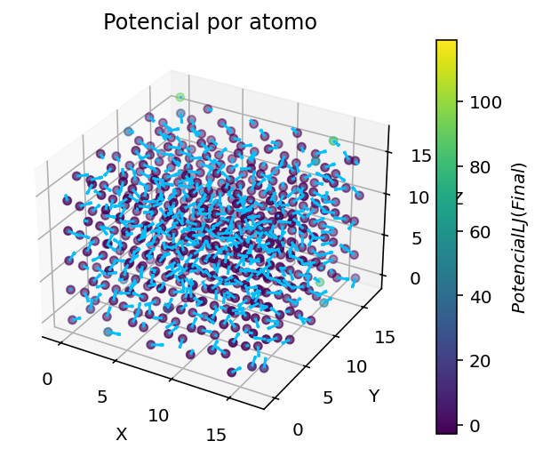

The 800 K final-state map shows intermediate disorder between room-temperature and high-temperature cases, with larger heterogeneity than 300 K but less extreme than the 1600 K snapshot.

## Base 300 K thermodynamics
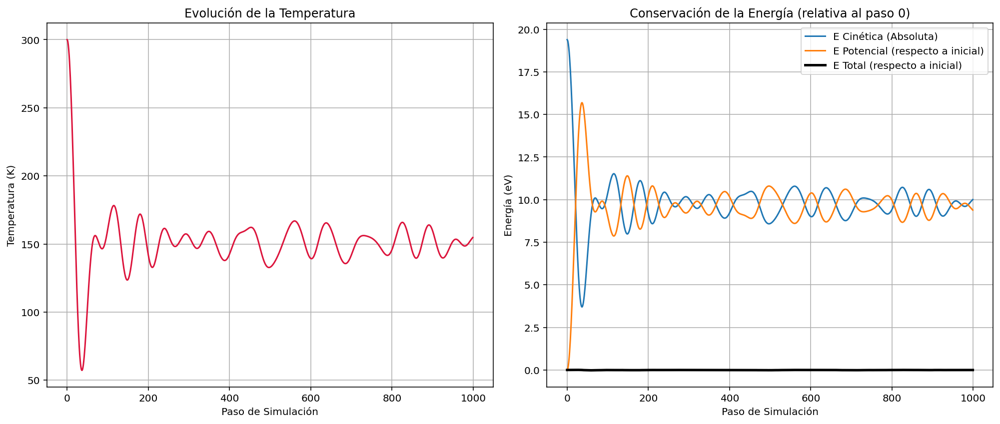

The base run shows expected energy exchange between $E_{\mathrm{kin}}$ and $U$. Temperature fluctuates around a finite mean, while $E_{\mathrm{tot}}$ should remain comparatively stable if the timestep is adequate.

## Temperature comparison
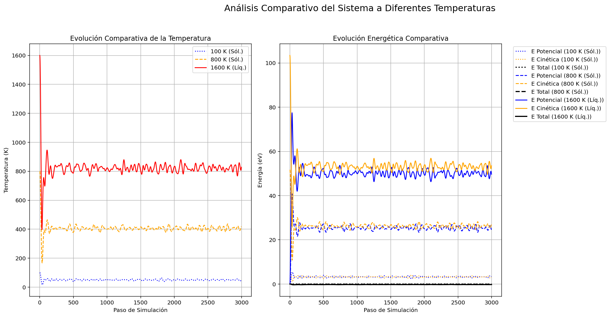

Higher initialization temperature increases kinetic energy and generally amplifies potential-energy fluctuations because particles sample broader regions of the interaction well.

## Timestep stability
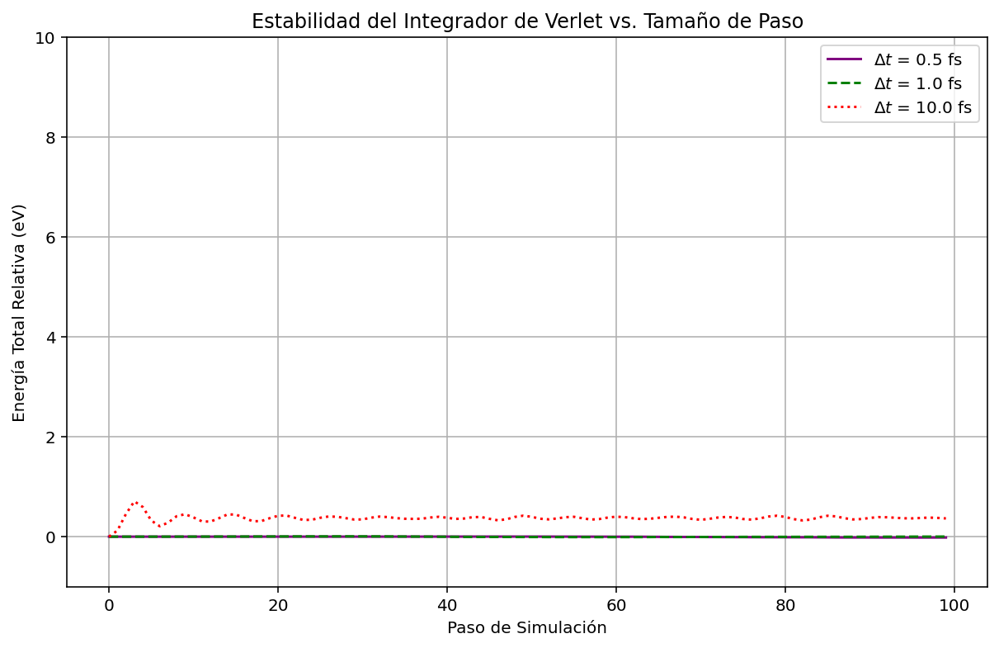

The stability plot illustrates that large $\Delta t$ values degrade integration quality. A suitable timestep keeps total energy fluctuations bounded and avoids artificial numerical heating.

## System-size dependence
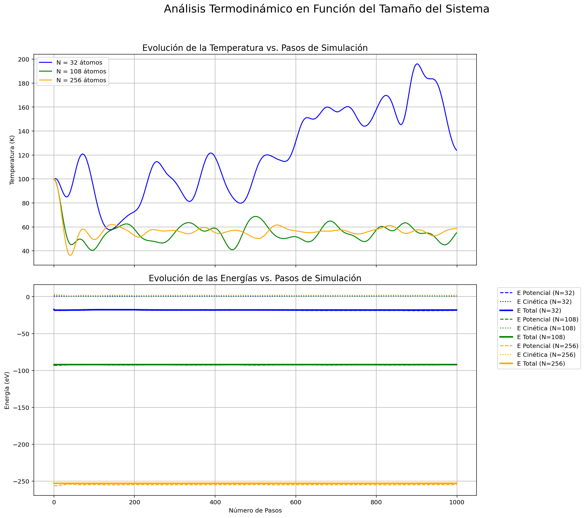

Larger systems typically show smoother thermodynamic curves due to reduced relative fluctuations, consistent with statistical scaling near $1/\sqrt{N}$.

## OVITO / radial distribution analysis
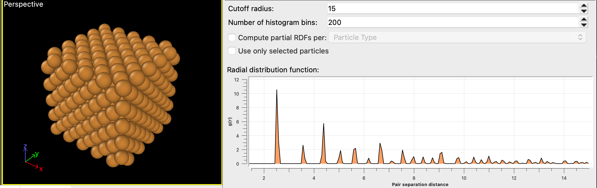
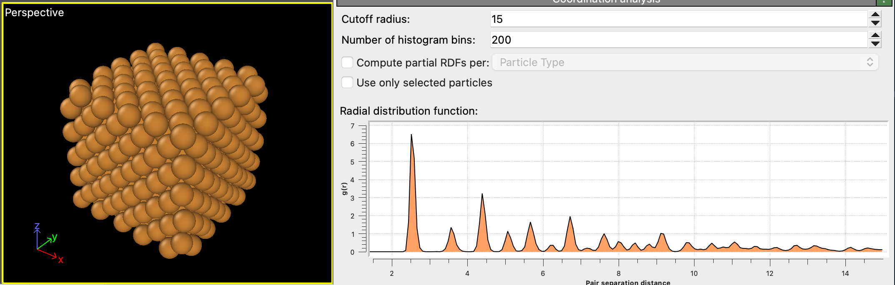
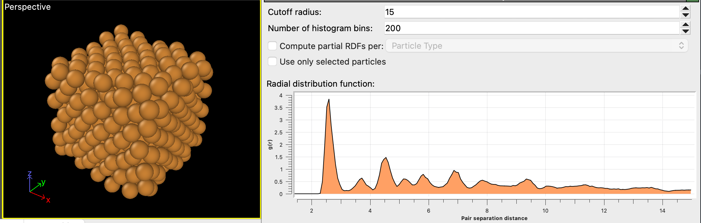
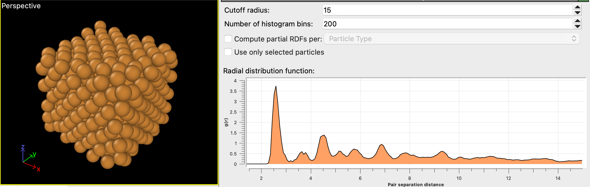

The OVITO RDF plots are consistent with a crystal-to-disordered trend: low temperature gives sharper peaks (strong shell order), while higher temperature broadens peaks and weakens medium-range order.

## Limitations
- Lennard-Jones for copper is an educational simplification, not a production metallic potential.
- Quantitative high-temperature behavior and phase-transition predictions should be treated with caution.
- Finite-size and cutoff effects can influence detailed values even when qualitative trends are correct.
